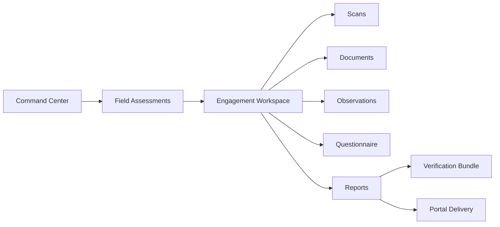
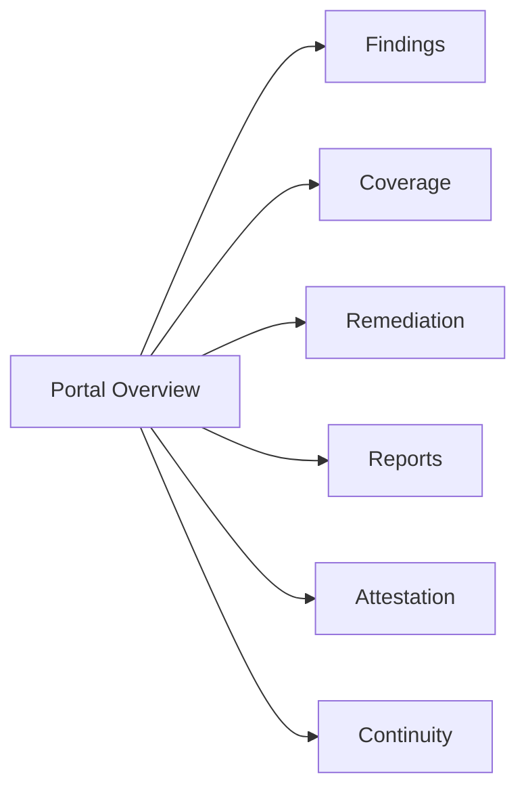
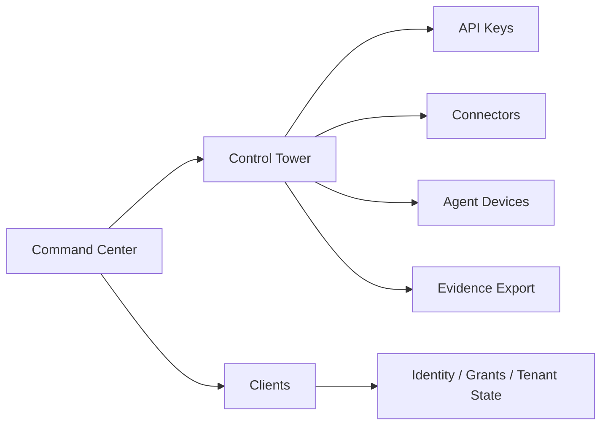
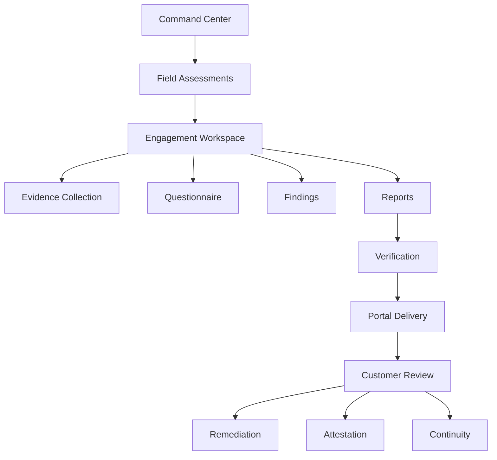

# FrostGate PR 18.6 Audit
## Unified Governance Command Center and Portal Information Architecture Blueprint

Date: 2026-07-02  
Scope: Console + Portal information architecture, workflow, dependency, maturity, and commercial-readiness audit  
Change policy: No code changes, no route changes, no renames, no navigation moves, no redesign implementation

---

## 1. Audit Standard

This document builds on `audits/2026-07-02_frostgate_console_portal_architecture_audit_phase1.md`.

Evidence sources used in this audit:

- Source routes and navigation:
  - `apps/console/components/layout/Sidebar.tsx`
  - `apps/portal/app/layout.tsx`
  - `apps/console/app/dashboard/page.tsx`
  - `apps/console/app/field-assessment/page.tsx`
  - `apps/console/app/field-assessment/[engagementId]/page.tsx`
  - `apps/portal/app/page.tsx`
  - `apps/portal/app/engagement/[engagementId]/page.tsx`
  - `apps/portal/app/findings/page.tsx`
  - `apps/portal/app/remediation/page.tsx`
  - `apps/portal/app/reports/page.tsx`
  - `apps/portal/app/attestation/page.tsx`
  - `apps/portal/app/continuity/page.tsx`
  - `apps/portal/app/assistant/page.tsx`
- BFF policy and API exposure:
  - `apps/console/app/api/core/[...path]/route.ts`
  - `apps/portal/app/api/core/[...path]/route.ts`
- Operator workflow and architecture references:
  - `docs/operators/console_user_guide.md`
  - `docs/operators/onboarding_runbook.md`
  - `docs/operators/auth0_roles.md`
  - `docs/architecture/PLATFORM_ARCHITECTURE.md`
  - `docs/architecture/service_map.md`
- Generated inventories:
  - `artifacts/platform_inventory.det.json`
  - `artifacts/full_repo_census/06_FRONTEND_PORTAL_CONSOLE_MAP.md`
  - `artifacts/full_repo_census/09_AUTH_IDENTITY_RBAC_TENANT_MAP.md`
  - `artifacts/full_repo_census/11_RAG_EVALUATION_AGENT_MAP.md`
  - `artifacts/full_repo_census/12_BILLING_MONETIZATION_MAP.md`
  - `artifacts/full_repo_census/13_DEAD_DUPLICATE_ORPHAN_PLACEHOLDER_MAP.md`

Verification inherited from Phase 1:

- Console node tests: `243 passed`
- Portal node tests: `30 passed`
- Route inventory / mount inventory pytest: `31 passed`
- Portal grant / admin identity pytest: `148 passed`

Repository-level facts used here:

- Runtime routes: `1125`
- Contract routes: `932`
- Dead/duplicate/orphan/placeholder findings: `403`
- Console pages inventoried in Phase 1: `31`
- Portal pages inventoried in Phase 1: `12`

Important constraint: the repository does not contain production clickstream telemetry. Sections that estimate page frequency, heatmaps, or journey frequency are source-derived from runbooks, navigation prominence, API density, tested workflows, and route wiring. They are evidence-backed estimates, not live usage analytics.

Scoring scale used below:

- `0` absent
- `1` skeletal
- `2` partial
- `3` functional
- `4` strong
- `5` enterprise-strong

Abbreviations:

- `Ex` existence
- `Ar` architecture
- `In` integration
- `WF` workflow completeness
- `UI` UI completeness
- `Po` portal exposure
- `ER` enterprise readiness
- `Se` security
- `Au` auditability
- `Sc` scalability
- `UX` user experience

---

## 2. Executive Summary

The current FrostGate product has one clear enterprise-grade operational spine: `Field Assessments -> Engagement Workspace -> Reports -> Portal`. That spine is supported by explicit runbook guidance in `docs/operators/onboarding_runbook.md`, dense API integration in `apps/console/app/field-assessment/[engagementId]/page.tsx`, and mirrored customer visibility in the portal engagement, findings, remediation, and reports surfaces.

The rest of the platform is materially broader than the current top-level user experience. The backend exposes large authority families for identity governance, intelligence, replay, counterfactual analysis, billing, benchmarking, provider governance, and autonomous workflows, but many of those authorities are not first-class destinations in the Console or Portal. The result is an architectural mismatch: the platform is technically wide, but the information architecture is still anchored to a narrower assessment product.

The highest-risk UX issues are structural rather than visual:

- Primary navigation contains placeholder or weakly-wired surfaces.
- The Console mixes daily operations, future-state capabilities, and legacy flows in the same top-level rail.
- The Portal markets itself as read-only in `apps/portal/app/layout.tsx`, but the BFF explicitly allows attestation submission, report verification, and remediation status mutation in `apps/portal/app/api/core/[...path]/route.ts`.
- Several portal pages depend on `localStorage` engagement context via `apps/portal/lib/engagementStore.ts`, creating fragile cross-page continuity.
- Legacy `/assessment` and `/onboarding` flows overlap with the stronger `/field-assessment` workflow.
- Hidden or contextual routes such as `/audit`, `/keys`, `/governance/topology`, `/products*`, and `/reports/{reportId}` have business value but no coherent primary-home story.

For PR 18.6, the platform does not need new authorities. It needs a truthful enterprise information architecture that:

- makes the field-assessment-to-portal spine primary,
- gives underrepresented trust/governance authorities an explicit home,
- demotes legacy or low-value surfaces from primary navigation,
- separates operator command surfaces from specialist and admin surfaces,
- preserves all current capabilities and routes during migration.

---

## 3. Capability Maturity Matrix

### 3.1 Matrix

| Capability | Ex | Ar | In | WF | UI | Po | ER | Se | Au | Sc | UX | Overall | Evidence note |
| --- | ---: | ---: | ---: | ---: | ---: | ---: | ---: | ---: | ---: | ---: | ---: | ---: | --- |
| Assessment | 5 | 4 | 5 | 5 | 4 | 3 | 4 | 4 | 5 | 4 | 4 | 4.3 | Core operator workflow documented in onboarding runbook and implemented in field assessment list/detail pages |
| Evidence | 5 | 4 | 5 | 4 | 4 | 3 | 4 | 4 | 5 | 4 | 4 | 4.2 | Evidence links, documents, scans, provenance, verification bundle all implemented |
| Verification | 4 | 4 | 4 | 3 | 3 | 3 | 4 | 5 | 5 | 4 | 3 | 3.8 | Verification bundle present in console and portal, but still contextual rather than product-primary |
| Trust | 4 | 4 | 3 | 3 | 2 | 2 | 4 | 5 | 5 | 4 | 2 | 3.5 | HMAC chain, replay verify, report verify exist; trust story underexposed in IA |
| Transparency | 4 | 4 | 3 | 3 | 2 | 3 | 4 | 4 | 4 | 4 | 2 | 3.4 | Provenance and continuity exist, but are fragmented across specialist screens |
| Privacy | 3 | 3 | 2 | 2 | 1 | 1 | 3 | 5 | 4 | 3 | 1 | 2.5 | Privacy controls appear in backend and evidence metadata more than first-class UX |
| Reports | 5 | 4 | 5 | 4 | 4 | 4 | 4 | 4 | 5 | 4 | 4 | 4.3 | Report generation, version history, portal summary, PDF/JSON export, signature verify all present |
| Portal | 5 | 4 | 4 | 4 | 4 | 5 | 4 | 4 | 4 | 4 | 4 | 4.2 | Portal overview, engagement, findings, coverage, attestation, remediation, continuity, reports implemented |
| Remediation | 4 | 4 | 4 | 4 | 4 | 5 | 4 | 4 | 4 | 4 | 4 | 4.1 | Customer loop closure is real, but portal page still flagged placeholder/static in census |
| Governance | 5 | 4 | 3 | 3 | 3 | 2 | 4 | 4 | 5 | 4 | 3 | 3.6 | Governance breadth exceeds current UI story |
| Governance Learning | 2 | 2 | 1 | 1 | 1 | 0 | 2 | 2 | 2 | 2 | 1 | 1.5 | No first-class learning surface found |
| Governance Optimization | 2 | 2 | 1 | 1 | 1 | 0 | 2 | 2 | 2 | 2 | 1 | 1.5 | Optimization appears as latent authority, not an operator experience |
| Governance Orchestration | 4 | 4 | 2 | 2 | 1 | 0 | 3 | 4 | 4 | 4 | 1 | 2.6 | Autonomous governance workflow backend exists in census, UI home is missing |
| Governance Intelligence | 4 | 4 | 2 | 2 | 1 | 0 | 3 | 4 | 4 | 4 | 1 | 2.7 | Intelligence routes exist in inventory, first-class UX does not |
| Decision Provenance | 4 | 4 | 3 | 2 | 2 | 1 | 4 | 5 | 5 | 4 | 2 | 3.3 | Decisions + provenance are present but specialist and non-primary |
| Benchmarking | 3 | 3 | 1 | 1 | 0 | 0 | 2 | 3 | 3 | 3 | 0 | 1.8 | Runtime routes exist; customer or operator home does not |
| Simulation | 3 | 3 | 1 | 1 | 0 | 0 | 2 | 3 | 3 | 3 | 0 | 1.8 | Similar to benchmarking; authority exists, IA absent |
| Replay | 4 | 4 | 2 | 2 | 1 | 1 | 3 | 4 | 5 | 4 | 1 | 2.8 | Replay verify exists in Control Tower; broader replay authority is hidden |
| Counterfactual | 3 | 3 | 1 | 1 | 0 | 0 | 2 | 3 | 3 | 3 | 0 | 1.7 | Only route authority surfaced in inventory |
| Notifications | 3 | 2 | 2 | 1 | 1 | 1 | 2 | 3 | 3 | 3 | 1 | 2.0 | Feed and event timelines exist, but no coherent notification center |
| Administration | 4 | 4 | 3 | 3 | 3 | 1 | 4 | 4 | 4 | 4 | 2 | 3.3 | Clients, settings, keys, identity, control-tower functions exist but are fragmented |
| Providers | 4 | 3 | 2 | 1 | 1 | 0 | 3 | 4 | 4 | 4 | 1 | 2.4 | Backend provider governance is stronger than UI exposure |
| Identity | 4 | 4 | 3 | 2 | 2 | 1 | 4 | 5 | 5 | 4 | 2 | 3.3 | Strong backend + RBAC docs, weak product discoverability |
| Billing | 4 | 4 | 2 | 1 | 1 | 0 | 3 | 4 | 4 | 4 | 1 | 2.5 | Billing ledger and usage exist, customer/admin story is not first-class |
| Workforce | 4 | 4 | 3 | 2 | 2 | 0 | 3 | 4 | 4 | 4 | 2 | 2.9 | Workforce Intel exists in nav, but role story and workflow depth are limited |
| Evaluation Lab | 4 | 4 | 3 | 2 | 2 | 0 | 3 | 4 | 4 | 4 | 2 | 3.0 | Evaluation authority exists and is tested; specialist-only and not operationalized |
| Control Tower | 5 | 4 | 4 | 4 | 4 | 0 | 4 | 5 | 5 | 4 | 4 | 4.0 | Best admin/operator control plane in the current console |

### 3.2 Weakest capabilities

Weakest current capabilities by overall maturity:

1. Governance Learning
2. Governance Optimization
3. Counterfactual
4. Benchmarking
5. Simulation
6. Notifications
7. Providers
8. Billing

Interpretation:

- These are not necessarily absent in code.
- They are weak because their business authority is not matched by discoverable, coherent user experience.
- PR 18.6 should treat these as visibility and ownership problems before treating them as implementation gaps.

---

## 4. Persona Journey Maps

These journeys are source-derived from runbooks, route structure, page code, and role docs. They are not based on production telemetry.

### 4.1 Persona matrix

| Persona | Primary goals | Source-backed common workflow | Highest-value pages | Likely low-value or unused pages | Pain points |
| --- | --- | --- | --- | --- | --- |
| Executive | Understand risk posture and readiness | Command Center -> Readiness -> Reports -> Portal overview | `/dashboard`, `/dashboard/readiness`, `/reports/{reportId}`, `/` | `/dashboard/corpus`, `/dashboard/retrieval`, `/keys` | Too much specialist navigation before value is visible |
| Board Member | Review exposure, progress, trust posture | Portal overview -> Reports -> Findings -> Continuity | `/`, `/reports`, `/findings`, `/continuity` | `/assistant`, deep assessment tabs | Portal context depends on selected engagement, not board-centric packaging |
| CISO | Assess enterprise risk, evidence quality, remediation progress | Command Center -> Field Assessment -> Findings -> Reports -> Portal remediation | `/dashboard`, `/field-assessment/{id}`, `/dashboard/forensics`, `/reports`, `/remediation` | `/products*` | Trust and evidence authorities are spread across multiple specialist pages |
| Compliance Officer | Track control coverage and remediation | Readiness -> Questionnaire -> Reports -> Coverage | `/dashboard/readiness`, `/field-assessment/{id}`, `/reports`, `/coverage` | `/dashboard/control-tower`, `/dashboard/corpus` | Coverage and remediation are split across console and portal |
| Auditor | Verify evidence, signatures, chain of custody | Field Assessment -> Evidence -> History -> Reports -> Verify | `/field-assessment/{id}`, `/dashboard/provenance`, `/dashboard/forensics`, `/reports`, `/reports` in portal | `/dashboard/workforce` | Verification is real but not assembled into a single audit investigation flow |
| Operator | Monitor health and execute platform actions | Command Center -> Control Tower -> Forensics -> Clients | `/dashboard`, `/dashboard/control-tower`, `/dashboard/forensics`, `/admin/tenants` | `/assessment` | Daily operator story competes with legacy and placeholder pages |
| Assessment Engineer | Run scans, capture evidence, generate reports | Field Assessments -> Engagement -> Scans/Documents/Observations -> Questionnaire -> Reports | `/field-assessment`, `/field-assessment/{id}` | `/dashboard/providers`, `/dashboard/policies` | This workflow is strong; friction comes from breadth and repeated refresh/load patterns |
| Field Assessor | Conduct client engagement end-to-end | Field Assessments -> New Engagement -> Engagement tabs -> Report -> Delivered | `/field-assessment`, `/field-assessment/{id}` | Most non-assessment specialist pages | Best-supported persona in the product today |
| Customer | Consume findings and close actions | Portal overview -> Findings -> Remediation -> Reports -> Attestation | `/`, `/findings`, `/remediation`, `/reports`, `/attestation` | `/assistant` | Engagement context persistence is fragile; portal “read-only” label is misleading |
| MSP | Manage several client states | Clients -> Field Assessments -> Portal grants -> Reports | `/admin/tenants`, `/field-assessment`, portal grant surfaces via APIs | `/assessment` | Multi-tenant ownership exists in APIs more than in a clean UX model |
| Consultant | Run assessment packages repeatedly | Onboarding runbook -> Field Assessments -> Reports -> Portal handoff | `/field-assessment`, `/reports`, `/` portal | `/dashboard/workforce`, `/products*` | Legacy `/onboarding` and `/assessment` muddy the intended entry point |
| Platform Administrator | Manage keys, agents, connectors, tenants | Control Tower -> Clients -> Identity admin -> Settings | `/dashboard/control-tower`, `/admin/tenants`, `/dashboard/settings` | `/coverage`, `/continuity` | Admin capabilities are broad but split across unrelated top-level surfaces |
| Support Engineer | Diagnose issues and verify route health | Command Center -> Forensics -> Control Tower -> Audit/health endpoints | `/dashboard`, `/dashboard/forensics`, `/dashboard/control-tower` | Portal workflow pages | Health, audit, and control flows are strong but not unified into one support workspace |
| Developer | Validate route wiring and authority exposure | Census docs -> BFF routes -> page code -> tests | `artifacts/full_repo_census/*`, BFF route files, page files | End-user portal screens | Strong internal evidence, weak public-facing authority map |

### 4.2 Journey diagrams

#### Operator / Field Assessor



#### Customer



#### Administrator



### 4.3 Cross-persona findings

- The field assessor is the most coherent persona.
- The customer is the second most coherent persona.
- The executive, board, auditor, MSP, and compliance personas all depend on capabilities that exist but are not packaged around their real questions.
- The platform administrator has the power surface, but not a clean admin IA.

---

## 5. Screen Dependency Graph

### 5.1 Observed navigation topology

Static route/link inspection shows the following hub pattern:

- Console hub: `/dashboard`
- Operator hub: `/field-assessment`
- Operator workspace hub: `/field-assessment/{engagementId}`
- Portal hub: `/`
- Portal contextual drill-down: `/engagement/{engagementId}`

Computed navigation depth from static route graph:

- Console max depth from `/dashboard`: `3`
- Console average depth: `1.23`
- Console median depth: `1`
- Portal max depth from `/`: `2`
- Portal average depth: `1`
- Portal median depth: `1`

### 5.2 Console dependency table

| Screen | Inbound role | Outbound destinations | Key authorities / APIs | Dependency class | Finding |
| --- | --- | --- | --- | --- | --- |
| `/dashboard` | global hub | `/onboarding`, `/reports`, `/audit`, `/dashboard/forensics` | health, stats, feed, billing readiness, control-tower snapshot | central hub | Strong landing page, but mixes daily truth with placeholder metrics and legacy quick actions |
| `/dashboard/control-tower` | admin/operator | internal modals and snapshot refresh | keys, connectors, agents, lockers, evidence export, incidents | admin command center | Strongest admin surface |
| `/dashboard/assistant` | specialist | no major route fan-out | `ui/ai/chat` | specialist leaf | Valuable but not primary for most personas |
| `/dashboard/corpus` | specialist | document drill-down within page | corpus/document routes | specialist leaf | Useful governance support page |
| `/dashboard/retrieval` | specialist | save policy in place | retrieval policy routes | specialist leaf | Important authority, narrow audience |
| `/dashboard/provenance` | specialist/auditor | evidence detail within page | evidence + audit chain | specialist leaf | Underrepresented trust authority |
| `/dashboard/policies` | nav-exposed | minimal | none proven beyond placeholder framing | weak leaf | Top-level nav overstates maturity |
| `/dashboard/providers` | nav-exposed | minimal | provider governance routes exist in BFF | weak leaf | Authority is real, UX is not |
| `/dashboard/readiness` | governance | assessment/framework drill-down inside page | readiness control-plane routes | governance hub | High business value, should be more prominent in future IA |
| `/field-assessment` | governance | `/field-assessment/{engagementId}` | engagement list/create | workflow hub | Correct primary entry for assessments |
| `/field-assessment/{engagementId}` | assessment | tabbed internal flow, report actions | engagement, scans, docs, observations, evidence, findings, questionnaire, audit events, reports | workflow core | Most complete screen in product |
| `/dashboard/forensics` | compliance/support | trace/event drill-down | forensics events and trace | specialist hub | High support value, not well-connected from other trust screens |
| `/dashboard/decisions` | compliance | limited | decisions authority | specialist leaf | Valuable but too isolated |
| `/dashboard/evaluation` | specialist | run/query comparison within page | evaluation routes | specialist leaf | Good authority, low discoverability outside specialists |
| `/dashboard/workforce` | specialist/admin | management actions within page | workforce users/activity/alerts | specialist leaf | Exists, but workflow ownership unclear |
| `/admin/tenants` | admin | `/admin/tenants/{tenantId}` | tenants and grant-related backend | admin hub | Important for MSP/admin story |
| `/admin/tenants/{tenantId}` | admin | local actions, email flow | tenant detail, portal/email hooks | contextual admin | Contextual only; not general-user navigation |
| `/dashboard/settings` | admin | local | settings/admin utilities | admin leaf | Appropriate contextual admin page |
| `/assessment` | system nav | internal stepper | legacy assessment client | legacy leaf | Duplicates stronger field-assessment story |
| `/audit` | contextual from dashboard | local | audit surface | hidden high-value leaf | Valuable but hidden and legacy-positioned |
| `/onboarding` | contextual from dashboard | stepper progression | legacy assessment flow | legacy workflow | Conflicts with field-assessment entry |
| `/reports/{reportId}` | contextual | local | report detail | contextual artifact | Correctly contextual |
| `/governance/topology` | hidden | local | governance graph/assets | hidden authority | Strong candidate for future governance contextual surface |
| `/keys` | hidden | local | keys routes | hidden admin | Better as admin context, not freestanding nav |
| `/products*` | hidden/legacy | product detail/create | products routes | orphaned product cluster | Weak fit with current enterprise governance story |

### 5.3 Portal dependency table

| Screen | Inbound role | Outbound destinations | Key authorities / APIs | Dependency class | Finding |
| --- | --- | --- | --- | --- | --- |
| `/` | customer hub | `/findings`, `/reports`, `/attestation`, `/continuity` | engagement list, findings, questionnaires, remediation roadmap, attestation health | central hub | Strong overview, best customer summary page |
| `/engagement` | customer | `/engagement/{engagementId}` | engagement list | list hub | Secondary hub, but context is also stored globally |
| `/engagement/{engagementId}` | customer | back to `/engagement`, report link | engagement summary, scans, documents, observations, evidence, verification bundle | contextual workspace | Strong transparency screen |
| `/findings` | customer | dashboard linkback | findings + explain | workflow leaf | High business value |
| `/reports` | customer | dashboard linkback | list/get/export/verify report | workflow leaf | Strong export/verification surface |
| `/coverage` | customer | dashboard linkback | questionnaire-derived coverage | workflow leaf | Valuable for compliance buyers |
| `/attestation` | customer | local submit flow | assets + attestations + submit attestation | actionable leaf | Conflicts with “read-only” portal label |
| `/remediation` | customer | dashboard linkback | roadmap + patch status | workflow leaf | High action value |
| `/continuity` | customer | local filters | continuity gaps + attestation health | workflow leaf | Useful trust/compliance follow-on surface |
| `/assistant` | customer | local | `ui/ai/chat` | specialist leaf | Lowest-value top-level portal page today |
| `/login` | access gate | `/` after auth | portal auth exchange | access only | Necessary access page |
| `/accept-invite` | access gate | portal session establishment | portal invite acceptance | access only | Necessary access page |

### 5.4 Graph findings

Dead ends:

- Many specialist screens are leaf-only and do not route users naturally into the next business step.
- `/dashboard/policies` and `/dashboard/providers` are especially weak relative to their nav weight.

Circular or bounce-heavy patterns:

- Portal list/detail pages often bounce through overview and query-param engagement selection.
- Several portal workflow pages fall back to `getStoredEngagementId()` from local storage rather than maintaining explicit route state.

Hidden screens:

- `/audit`
- `/governance/topology`
- `/keys`
- `/products`, `/products/new`, `/products/{id}`
- `/reports/{reportId}`
- `/admin/tenants/{tenantId}`

Duplicate or overlapping paths:

- `/assessment` and `/onboarding` overlap with `/field-assessment`
- duplicated app tree under `apps/console/console/*`

Screens with excessive dependency:

- `/dashboard` is overloaded with health, billing, feed, assessment shortcuts, and future metrics
- `/field-assessment/{engagementId}` is large but justified; it is the true operator workspace

---

## 6. Workflow Friction Report

Counts below are minimum observable steps from source and runbook, not live user-session traces.

| Workflow | Observable path | Clicks | Page transitions | Dialogs / prompts | Key API families | Manual steps | Friction findings |
| --- | --- | ---: | ---: | ---: | --- | --- | --- |
| Assessment creation | `/field-assessment` -> New Engagement -> create -> detail -> set status | 4-5 | 2 | 1 | `listEngagements`, `createEngagement`, `transitionEngagement` | client metadata entry | Efficient enough; strongest operator start point |
| No-auth evidence collection | engagement -> Scans tab -> run DNS/Web/Network | 6-10 | 0 after entry | repeated confirmations in scan controls | scan create/list + evidence refresh | domain/URL/host entry | Single workspace is good; repeated refresh patterns increase operator effort |
| MS Graph evidence collection | engagement -> Scans tab -> run connector -> device code -> repeat per connector | 10+ per connector | 0 after entry | repeated auth prompts | scan + import + findings | tenant ID entry, client-admin participation | Highest operational friction; each connector repeats device-code flow |
| Interview / observation capture | engagement -> Observations / Interviews | 3-5 | 0 | inline edit/delete confirm | observation CRUD | narrative entry | Acceptable; split tabs add tab switching cost |
| Questionnaire completion | engagement -> Questionnaire | 2-3 | 0 | inline form saves | questionnaire/readiness | assessor judgment | Strongly tied to evidence workflow |
| Finding normalization | engagement -> Findings | 2-3 | 0 | local refresh/reload | list findings | analyst review | Good context, but findings are not elevated early enough outside engagement |
| Report generation | engagement -> Reports -> generate -> version history | 3-5 | 0 | generation/verify actions | get/generate/export report | reviewer interpretation | Strong within engagement; console-level report discovery is weak |
| Portal publication | operator delivery step -> portal login/share | 3-6 | 1-2 | portal auth | portal auth/grants/report access | share credentials/invite | Business-critical handoff still feels separate from assessment core |
| Customer remediation | portal overview -> remediation -> update finding status | 3-5 | 1 | status form | roadmap + finding patch | owner email, notes | Good action flow; contradicts “read-only” portal messaging |
| Attestation submission | portal overview -> attestation -> asset form -> submit | 4-6 | 1 | form validation | assets + attestations | owner email, statement | Real workflow hidden behind misleading portal label |
| Report export and trust verification | portal reports -> summary -> export JSON/PDF -> verify | 4-6 | 0 | verify/download prompts | get/export/verify report | artifact handling | Strong enterprise proof point |
| Governance investigation | command center -> forensics / provenance / decisions | 4-8 | 1-2 | local filters | decisions, forensics, provenance | analyst triage | Split across too many specialist pages |
| Replay / simulation / benchmark | no first-class route path | N/A | N/A | N/A | intelligence routes in inventory | N/A | Authority exists, workflow does not |

### 6.1 Highest-friction workflow segments

1. Repeated device-code authentication across connectors
2. Portal cross-page engagement context persistence
3. Governance investigation split across multiple specialist pages
4. Dashboard quick actions sending users into legacy flows
5. Underrepresented report and trust authorities outside contextual screens

---

## 7. Navigation Depth Report

### 7.1 Current structure

Console sidebar groups in source:

- Operations
- AI & Knowledge
- Governance
- Compliance
- Workforce
- Admin
- System

Portal top nav in source:

- Overview
- Assessment
- Findings
- Reports
- Coverage
- Attestation
- Remediation
- Continuity
- AI Assistant

### 7.2 Findings

Console:

- Depth is not the primary problem. `1.23` average depth is already shallow.
- Breadth and truthfulness are the problem. Too many first-level items are low-frequency, weakly-wired, or future-facing.
- The console has a discoverability surplus and a prioritization deficit.

Portal:

- Depth is acceptable.
- Context continuity is the problem. Several pages depend on stored engagement state instead of route clarity.

### 7.3 Recommended target depth

Without renaming any current module names:

- Console target: keep average depth around `1.2-1.5`, but reduce first-class top-level destinations to the pages that matter daily.
- Portal target: preserve current shallow depth, but eliminate hidden engagement-state dependency as the primary continuity mechanism in future implementation.

---

## 8. Information Density Report

Density classifications are source-derived from page structure, widget count, tabs, and action density.

| Screen | Density | Finding |
| --- | --- | --- |
| `/dashboard` | overloaded | Mixes health, billing, alerts, charts, readiness placeholders, quick actions, and assessment leftovers |
| `/dashboard/control-tower` | balanced | Dense but coherent around admin actions |
| `/dashboard/assistant` | balanced | Three-column specialist workspace; clear purpose |
| `/dashboard/corpus` | balanced | Good information-to-action ratio |
| `/dashboard/retrieval` | balanced | Compact and task-oriented |
| `/dashboard/provenance` | balanced | Specialist but appropriately dense |
| `/dashboard/policies` | sparse | Nav prominence exceeds visible capability |
| `/dashboard/providers` | sparse | Same issue as policies |
| `/dashboard/readiness` | balanced | Strong compliance value |
| `/field-assessment` | balanced | Good list/create surface |
| `/field-assessment/{engagementId}` | overloaded but justified | Highest data density in system; serves as true operator cockpit |
| `/dashboard/forensics` | balanced | Good analyst density |
| `/dashboard/decisions` | balanced | Focused but narrow |
| `/dashboard/evaluation` | balanced | Specialist workflow, acceptable density |
| `/dashboard/workforce` | balanced | Moderate density, unclear frequency |
| `/admin/tenants` | sparse-to-balanced | Admin page, but authority breadth exceeds current framing |
| `/assessment` | sparse | Legacy flow relative to stronger field-assessment workspace |
| `/audit` | balanced | Hidden but useful |
| `/onboarding` | balanced | Useful runbook support, but duplicates stronger entry |
| `/` portal | balanced | Best customer summary page |
| `/engagement` | sparse | Mostly routing into the deeper engagement screen |
| `/engagement/{engagementId}` | balanced | Good transparency drill-down |
| `/findings` | balanced | High utility, clear hierarchy |
| `/reports` | balanced | Strong action density |
| `/coverage` | balanced | Good compliance summary density |
| `/attestation` | balanced | Actionable, focused |
| `/remediation` | balanced | Strong customer action surface |
| `/continuity` | balanced | Useful trust follow-up |
| `/assistant` portal | sparse | Lowest-value portal top-nav page today |

### 8.1 Density findings

- The console home is too dense for a single narrative.
- The field assessment workspace is large but coherent because all density serves one engagement.
- Portal density is mostly good; its main weakness is not clutter, but context continuity and relative page priority.

---

## 9. Business Value Matrix

| Surface | Executive | Operational | Compliance | Audit | Customer | Criticality | Classification |
| --- | --- | --- | --- | --- | --- | --- | --- |
| Command Center | high | high | medium | low | none | high | Mission Critical |
| Field Assessments list/detail | medium | very high | high | high | indirect | very high | Mission Critical |
| Reports | very high | high | high | high | high | very high | Mission Critical |
| Portal Overview | high | medium | high | medium | very high | very high | Mission Critical |
| Findings | medium | high | high | high | very high | very high | Mission Critical |
| Remediation | medium | high | high | medium | very high | very high | Mission Critical |
| Readiness | high | medium | very high | medium | medium | high | High Value |
| Control Tower | low | very high | medium | high | none | high | High Value |
| Forensics | low | high | medium | very high | none | high | High Value |
| Provenance | low | medium | medium | very high | low | high | High Value |
| Coverage | medium | medium | high | medium | high | high | High Value |
| Continuity | medium | medium | high | medium | high | medium | High Value |
| Attestation | medium | low | high | medium | high | medium | High Value |
| Decisions | medium | medium | high | high | low | medium | Contextual |
| Evaluation Lab | low | medium | low | medium | none | medium | Contextual |
| Workforce Intel | low | medium | low | low | none | medium | Contextual |
| Corpus | low | medium | low | low | none | medium | Contextual |
| Retrieval | low | medium | low | low | none | medium | Contextual |
| AI Workspace | medium | medium | low | low | low | medium | Contextual |
| Clients | low | medium | medium | medium | none | medium | Administrative |
| Settings | none | low | low | low | none | low | Administrative |
| Keys | none | medium | low | medium | none | medium | Administrative |
| `/assessment` | low | low | low | low | none | low | Legacy |
| `/onboarding` | low | medium | medium | low | none | medium | Legacy / Contextual |
| `/products*` | low | low | low | low | none | low | Candidate for removal from primary story |
| Portal AI Assistant | low | low | low | low | low | low | Rare |

---

## 10. Authority Visibility Matrix

| Authority family | Visible where today | Discoverable? | Primary persona | Current issue |
| --- | --- | --- | --- | --- |
| Field assessment | Console nav + engagement workspace + portal engagement | yes | assessor, operator, customer | Best represented authority |
| Evidence and verification | engagement tabs, provenance, forensics, portal engagement, reports | partial | assessor, auditor | Split across multiple homes |
| Trust / audit chain | command center snippets, control tower, forensics, report verify | partial | auditor, support, CISO | Underrepresented relative to strategic importance |
| Readiness / control coverage | command center snippet, readiness page, portal coverage | yes | compliance, executive, customer | Good authority, not yet central in IA |
| Remediation | portal overview + remediation | yes | customer, compliance | Strong customer visibility |
| Identity governance | APIs + clients/admin surfaces | partial | admin, MSP | Strong backend, weak discoverability |
| Provider governance | BFF allows routes; page exists | weak | platform admin | Overpromised in nav relative to maturity |
| Workforce | single nav item | partial | admin | Present but not clearly owned |
| Governance intelligence | route inventory only | no | executive, governance analyst | Invisible authority |
| Replay | control tower replay verify + inventory routes | weak | auditor, support | No primary home |
| Simulation | route inventory only | no | executive, consultant | Invisible authority |
| Counterfactual | route inventory only | no | analyst | Invisible authority |
| Benchmarking | route inventory only | no | executive, MSP | Invisible authority |
| Billing / monetization | command center readiness banner only | weak | admin, finance, sales | Underrepresented commercial authority |
| Notifications / feed | dashboard recent events, timelines | partial | operator, customer | No unified notification model |

Primary findings:

- Invisible authorities: intelligence, simulation, counterfactual, benchmarking
- Overexposed authorities: policies, providers, assistant in portal
- Authorities without a clear primary home: trust, decision provenance, billing, identity governance

---

## 11. Module Relationship Matrix

| Module | Reads | Writes | Produces | Depends on | Permissions / trust | Console | Portal |
| --- | --- | --- | --- | --- | --- | --- | --- |
| Command Center | health, stats, feed, billing readiness, snapshot | none | operator status overview | core health, stats, feed, control-tower snapshot | session + BFF allowlist | yes | no |
| Control Tower | keys, agents, connectors, lockers, incidents | key, agent, connector, locker actions | audit events, exports, admin state | admin routes + snapshot | admin/operator | yes | no |
| Field Assessments | engagements, scans, docs, observations, evidence, findings, questionnaire, reports | create/update engagement state and evidence records | findings, reports, evidence graph | field-assessment APIs | governance read/write | yes | mirrored |
| Readiness | frameworks, assessments, controls | none via BFF | readiness scoring and reviewer context | readiness control plane | control-plane read | yes | partial via coverage |
| Forensics | audit events, traces | none | investigations | UI forensics routes | ui:read | yes | no |
| Decisions | decisions list/detail | none | decision evidence | decisions routes | ui:read | yes | no |
| Provenance | evidence, chain data | none | chain-of-custody views | evidence/audit routes | governance/ui read | yes | partial |
| AI Workspace | chat context and provider metadata | chat request | governed answer trace | `ui/ai/chat`, retrieval, policy | governed end-user surface | yes | yes |
| Corpus | corpora, documents | ingest retry/upload in surrounding tooling | document visibility | rag corpora/docs/upload | retrieval governance | yes | no |
| Retrieval | retrieval policy | save policy | policy state | rag retrieval policy | governance write | yes | no |
| Evaluation Lab | evaluation quality/runs | run selection compare | comparison outputs | evaluation routes | ui read | yes | no |
| Workforce Intel | workforce users, activity, rules | alert rules/user state | workforce metrics | workforce APIs | admin | yes | no |
| Clients | tenant list/detail, portal grants, identity | tenant actions, grants, email flow | tenant admin state | admin tenant + identity APIs | admin | yes | no |
| Portal Overview | engagements, findings, questionnaires, roadmap, attestation health | stored engagement selection | customer summary | portal BFF + localStorage | portal grant session | no | yes |
| Portal Findings | findings and explain | none | customer issue review | portal findings APIs | portal grant session | no | yes |
| Portal Remediation | roadmap | finding status patch | remediation closure | portal roadmap + finding patch | portal write exceptions | no | yes |
| Portal Reports | report list/detail/export/verify | verify action | PDF/JSON export, signature results | report APIs | portal read plus verify | no | yes |
| Portal Coverage | questionnaire-derived matrix | none | control visibility | portal coverage APIs | portal grant session | no | yes |
| Portal Attestation | assets, attestations | attestation submission | review-request artifacts | governance assets/attestations | portal write exceptions | no | yes |
| Portal Continuity | attestation health, continuity gaps | none | continuity risk summary | continuity APIs | portal grant session | no | yes |

---

## 12. Dashboard Effectiveness Report

| Dashboard / summary surface | Effective today | Main weakness |
| --- | --- | --- |
| Command Center | good for operators and demos | too many mixed narratives; placeholder metrics dilute trust |
| Control Tower | strong | admin-heavy; should remain role-scoped |
| Readiness | strong specialist dashboard | not yet promoted enough for compliance buyers |
| Portal Overview | strong | depends on engagement-state continuity |
| Continuity | useful | secondary trust story, not tied tightly to reports |
| Coverage | useful | strong for compliance, lightly connected elsewhere |
| Workforce Intel | moderate | authority and persona ownership unclear |
| Evaluation Lab | moderate | specialist-only, low operational discoverability |
| Governance pages as a set | weak-to-moderate | fragmented and inconsistent maturity across pages |

Missing KPI patterns:

- No single executive risk scorecard across trust, readiness, findings, and remediation
- Trust KPIs exist in fragments rather than a coherent trust dashboard
- Billing/commercial health is visible only as readiness fragments

Duplicate or weak KPIs:

- Command Center contains future-state cards with no live authority
- Risk domain scores depend on `sessionStorage`, not a durable assessment source

---

## 13. Navigation Heatmap

Estimated from runbook centrality, navigation prominence, workflow necessity, and API density.

### 13.1 High-frequency pages

- `/dashboard`
- `/field-assessment`
- `/field-assessment/{engagementId}`
- `/`
- `/findings`
- `/reports`
- `/remediation`

### 13.2 Medium-frequency pages

- `/dashboard/control-tower`
- `/dashboard/readiness`
- `/dashboard/forensics`
- `/dashboard/decisions`
- `/engagement`
- `/engagement/{engagementId}`
- `/coverage`
- `/attestation`
- `/continuity`
- `/admin/tenants`

### 13.3 Rare / specialist pages

- `/dashboard/assistant`
- `/dashboard/corpus`
- `/dashboard/retrieval`
- `/dashboard/provenance`
- `/dashboard/evaluation`
- `/dashboard/workforce`
- `/dashboard/settings`
- `/dashboard/policies`
- `/dashboard/providers`
- `/assistant` portal

### 13.4 Emergency / incident pages

- `/dashboard/control-tower`
- `/dashboard/forensics`
- `/audit`
- trust/report verification actions

### 13.5 Heatmap conclusion

Pages that deserve future top-level emphasis:

- Command Center
- Field Assessments
- Readiness
- Reports
- Findings / Remediation / Coverage / Continuity in portal
- Control Tower for admin-scoped use

Pages that should become contextual or specialist:

- AI Workspace
- Corpus
- Retrieval
- Provenance
- Evaluation Lab
- Workforce Intel
- Keys
- Topology
- individual report details

Pages that should leave the primary narrative:

- `/assessment`
- `/onboarding` as a first-class entry point
- `/products*`

---

## 14. Commercial Readiness Assessment

| Commercial scenario | Current support | Evidence-backed weakness |
| --- | --- | --- |
| Executive demo | moderate to strong | Command Center opens well, but placeholder metrics and scattered governance story reduce perceived maturity |
| Pilot customers | strong | Assessment -> report -> portal flow is real and demonstrable |
| SOC 2 discussion | strong in substance | Evidence, signing, audit chain, verification exist, but are not packaged as one audit story |
| ISO 27001 discussion | strong in substance | Readiness, evidence, remediation, continuity help, but governance and control mapping are fragmented |
| Healthcare | moderate | Privacy-sensitive evidence handling exists, but privacy is underrepresented in UI and messaging |
| Financial services | moderate to strong | Risk, evidence, verification, auditability are good; executive packaging needs tightening |
| Government contractors | moderate | Trust and audit layers are present; enterprise-grade presentation is not yet unified |
| MSPs | moderate | Multi-tenant and clients surfaces exist, but MSP operating model is not explicitly expressed in IA |
| Consultants | strong | Runbook and field-assessment flow are well suited to repeated delivery |
| Board presentations | moderate | Reports and portal are usable, but the product does not yet tell a concise board narrative from first principles |

Presentation weaknesses that lower enterprise maturity:

- placeholder-first navigation items
- hidden trust authorities
- legacy assessment entry points coexisting with newer workflow
- misleading portal “read-only” footer
- backend breadth not reflected in coherent product story

---

## 15. Enterprise Information Architecture Blueprint

This section is a recommendation set only. It does not rename or implement anything.

### 15.1 Findings-driven principles

From Sections 3 through 13:

1. The field assessment and portal delivery spine is the strongest real workflow and should become the default organizing principle.
2. Trust, verification, readiness, and remediation are business-critical authorities and should be easier to discover.
3. Admin, specialist, and future-state surfaces should not compete equally with daily workflow pages.
4. Any future IA must preserve existing routes and capability reachability during migration.

### 15.2 Recommended console ownership model

Primary navigation groups for PR 18.6:

- Operations
  - Command Center
  - Field Assessments
  - Reports
- Governance
  - Readiness
  - Decisions
  - Provenance
  - Policies
  - Providers
- Trust & Response
  - Audit & Forensics
  - Control Tower
- Knowledge & Testing
  - AI Workspace
  - Corpus
  - Retrieval
  - Evaluation Lab
- Administration
  - Clients
  - Workforce Intel
  - Settings

Contextual-only destinations:

- `/field-assessment/{engagementId}`
- `/reports/{reportId}`
- `/admin/tenants/{tenantId}`
- `/governance/topology`
- `/keys`
- `/audit`

Legacy or demotion candidates:

- `/assessment`
- `/onboarding`
- `/products*`

### 15.3 Recommended portal ownership model

Primary portal navigation should continue to favor:

- Overview
- Assessment
- Findings
- Remediation
- Reports
- Coverage
- Attestation
- Continuity

Contextual or secondary candidate:

- AI Assistant

### 15.4 Authority ownership recommendations

| Authority | Recommended home in future IA | Why |
| --- | --- | --- |
| Assessment operations | Field Assessments | strongest existing workflow |
| Readiness / controls | Readiness + Coverage | strongest compliance story |
| Trust / verification | Reports + Provenance + Audit & Forensics | currently fragmented |
| Remediation | Portal Remediation plus console contextual visibility | customer action loop already real |
| Identity governance | Clients / admin context | backend authority is broad but operationally administrative |
| Provider governance | Governance group | currently overexposed relative to maturity, but belongs with governance |
| Intelligence / replay / simulation / counterfactual | future Trust/Governance contextual modules | authorities exist but are not ready as equal top-level destinations today |

---

## 16. 18.6 Design Blueprint

### 16.1 Recommended navigation tree

Console:

```text
Command Center
Field Assessments
Readiness
Reports
Control Tower
Audit & Forensics
Decisions
Provenance
Policies
Providers
AI Workspace
Corpus
Retrieval
Evaluation Lab
Clients
Workforce Intel
Settings
```

Portal:

```text
Overview
Assessment
Findings
Remediation
Reports
Coverage
Attestation
Continuity
AI Assistant
```

### 16.2 Persona map

- Daily operator: Command Center, Field Assessments, Control Tower, Forensics
- Assessment staff: Field Assessments, Reports, Readiness
- Executive/compliance: Command Center, Readiness, Reports, Portal Overview/Coverage
- Customer: Portal Overview, Findings, Remediation, Reports, Attestation, Continuity
- Admin/MSP: Clients, Control Tower, identity/grant workflows

### 16.3 Workflow map



### 16.4 Dashboard ownership

- Command Center: operator daily health and alerting
- Readiness: compliance/control ownership
- Control Tower: platform admin control plane
- Portal Overview: customer executive summary

### 16.5 Priority implementation order for PR 18.6

1. Align navigation to the real workflow spine without breaking routes.
2. Remove legacy pages from primary prominence before adding any new authority surfaces.
3. Make trust, verification, and readiness easier to reach from primary workflow screens.
4. Normalize portal continuity around explicit engagement context.
5. Surface underrepresented governance/admin authorities only after primary workflow clarity is restored.

### 16.6 Migration strategy

- Preserve all current routes initially.
- Re-home pages in navigation before deleting or deprecating any route.
- Keep contextual routes valid even if removed from primary nav.
- Preserve portal grant, report export, verification, and assessment URLs for customer continuity.
- Use role-based exposure so admin and specialist surfaces remain reachable without dominating the default IA.

### 16.7 Backward compatibility considerations

- Maintain `/field-assessment/{engagementId}` contract untouched; it is the strongest workflow anchor.
- Maintain portal routes and report export/verify actions.
- Preserve BFF route allowlists and permission semantics while reshaping navigation.
- Do not break links from reports, invites, or shared customer instructions during IA migration.

### 16.8 Risk analysis

- Highest migration risk: hiding rather than preserving contextual trust/admin capabilities.
- Second risk: moving navigation without preserving portal engagement continuity.
- Third risk: promoting backend authorities before the user story for them is coherent.

---

## 17. Prioritized Implementation Plan for PR 18.6

### Tier 1: must happen

- Make Field Assessments, Readiness, Reports, and Portal delivery the primary enterprise story.
- Remove legacy `/assessment` and `/onboarding` from primary prominence.
- Correct the Portal information hierarchy so actionable customer pages are clearly primary.
- Give trust and verification authorities a coherent navigation path from reports and investigations.

### Tier 2: should happen

- Consolidate admin-owned capabilities under a clearer admin/control grouping.
- Reclassify AI Workspace, Corpus, Retrieval, Evaluation Lab, and Workforce Intel as specialist surfaces.
- Create explicit future homes for intelligence, replay, benchmarking, simulation, and counterfactual authorities.

### Tier 3: can follow

- Rationalize hidden/orphaned `/products*`, `/keys`, and topology surfaces.
- Decide whether portal AI Assistant remains top-level or becomes contextual.
- Package billing and commercial authorities for customer/admin visibility if they are part of the product sale.

---

## 18. Final Findings

1. FrostGate already has a real enterprise workflow, but it is narrower than the current platform authority set.
2. The product is strongest when it behaves like an assessment-to-remediation operating system.
3. The main information-architecture problem is not missing code. It is mismatch between capability breadth and navigational truth.
4. PR 18.6 should unify around the strongest existing workflow, then progressively expose underrepresented authorities without losing any route or capability.

